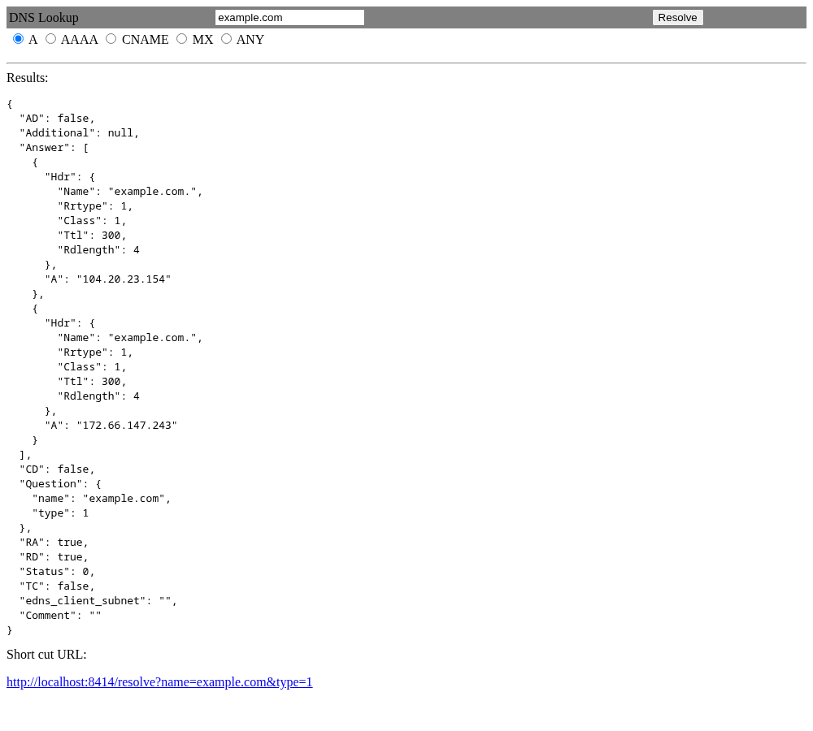
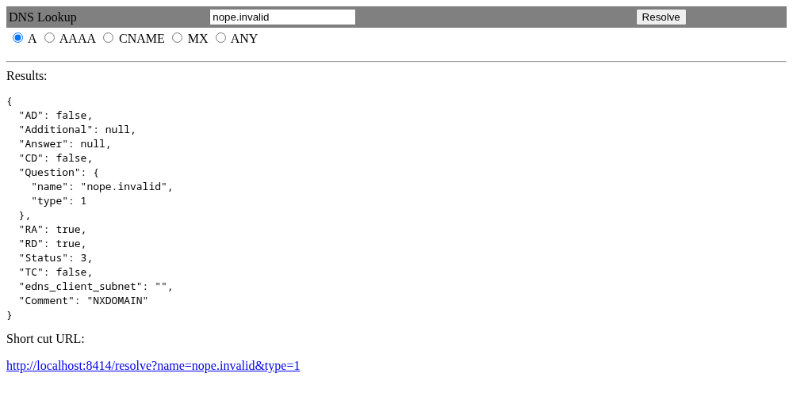

# https-dns-proxy
A Web interface to DNS.  


This is a quick implementation to be the opposite side of: https://github.com/wrouesnel/dns-over-https-proxy

You should be able to run this on a virtual instance where ever.  Or any CDN or Freedom advocate can run it.

This is a work in progress.  I used the basic TLS webserver from Go.  PRs and updates welcome.

## Screenshots

The lookup page at `/query` resolves a name and shows the JSON answer, plus a shortcut URL for the same query:



Failures come back in the same JSON shape, with the DNS rcode in `Status` and an explanation in `Comment`:



## Building
```
go build
```

## Running
```
./https-dns-proxy
```

## Usage 
```
Usage of ./https-dns-proxy:
  -conf string
    	Location of a config file.  Will override passed in parameters
  -allow-dnsserver
    	Let clients pick the upstream DNS server with ?dnsserver=<ip>. Public IPs only unless dnsserverallowlist is set in the config file
  -dnsport string
    	Port on the DNS server to talk to (default "53")
  -dnsserver string
    	DNS server you want to use as your source (default "8.8.8.8")
  -log string
    	Directory for log file.  Will not log if param is missing
  -port string
    	Port you want to listen on (default "8414")
  -sslcrtpath string
    	Path to SSL CRT file
  -sslkeypath string
    	Path to SSL Key file
```


## Config file

/etc/dnsproxy.yaml

```
dnsserver: 8.8.8.8
dnsport: 53
listenport: 8415
sslkeypath:
sslcrtpath:
logpath:
allowdnsserver: false
dnsserverallowlist:
  - 1.1.1.1
  - 9.9.9.0/24
```

If logpath is set it will create "dns-access.log" in that directory and log all requests there.

## API

`GET /resolve?name=<name>[&type=<n>][&dnssec=1][&cd=1]`

| Param | Meaning |
|---|---|
| `name` | Name to look up (required) |
| `type` | Numeric record type, e.g. `1` A, `28` AAAA, `15` MX. Default `255` (ANY) |
| `dnssec` | `1` sets the EDNS0 DO bit; RRSIGs are included in `Answer` |
| `cd` | `1` sets the Checking Disabled bit |
| `dnsserver` | Upstream DNS server IP to use instead of the configured one. Disabled by default; see below |

```
curl 'http://localhost:8414/resolve?name=example.com&type=1&dnssec=1'
```

The response is JSON: `Status` is the DNS rcode, `AD`/`CD`/`TC`/`RD`/`RA` come from the upstream response, and `Comment` explains failures (e.g. `NXDOMAIN`). `AD` is only meaningful if your upstream resolver validates DNSSEC. Truncated UDP answers are retried over TCP.

Errors are also JSON: `400` for a missing name or invalid type, `502` if the upstream DNS server can't be reached.

### Choosing the upstream server (`dnsserver`)

Off by default (`403`). Enable with `-allow-dnsserver` or `allowdnsserver: true`. Only IP literals are accepted (no hostnames), and the port is always the configured `dnsport`. Because this makes the server send queries to caller-chosen hosts:

- with no allowlist, only public unicast IPs are accepted; loopback, private, link-local, unspecified, carrier-grade NAT, benchmarking, documentation, reserved, and IPv6 transition (NAT64, 6to4, Teredo) addresses are rejected;
- with `dnsserverallowlist` (IPs or CIDRs) set, only those addresses are accepted, including private ones if you list them. Prefer this on anything internet-facing.

A human-friendly lookup page is at `/query`.

**Note:** there is no authentication or rate limiting, so anyone who can reach the server can use it as a resolver.

## Testing
```
go test ./...
```

All the heavy lifting is done with http://github.com/miekg/dns

GoDoc:  [](https://godoc.org/github.com/Harnish/https-dns-proxy)
